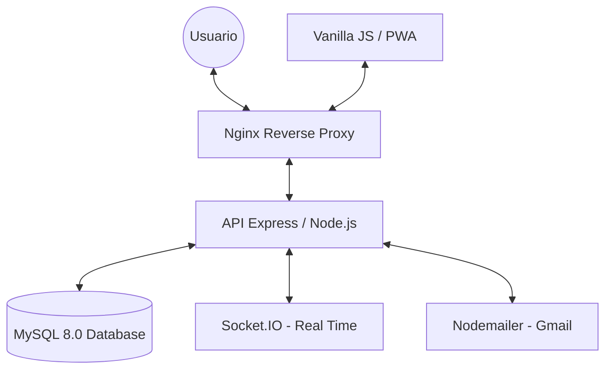

# 🔐 Passly - Sistema de Control de Accesos Inteligente


**Passly** es un sistema de control de accesos moderno y seguro diseñado para unidades residenciales, edificios corporativos y espacios que requieren gestión de entradas y salidas con tecnología QR, validación en tiempo real y reportes profesionales.

---

## 🌟 Características Principales

### 🔐 Autenticación y Seguridad (Hardened)
- ✅ Login seguro con JWT y verificación de rol
- ✅ Registro con validaciones estrictas (frontend + backend espejo)
- ✅ Autenticación de dos factores (MFA/2FA) vía TOTP (con alerta de seguridad por email)
- ✅ Recuperación de contraseña por email con códigos de 6 dígitos
- ✅ Email de Bienvenida automático para nuevos usuarios
- ✅ Invitaciones de acceso enviadas directamente al correo del huésped
- ✅ Helmet.js (CSP, HSTS 1 año + preload, X-Frame-Options)
- ✅ Rate Limiting por endpoint (login, register, recovery, API)
- ✅ Sanitización de inputs (prevención XSS)
- ✅ express-validator con reglas de negocio estrictas
- ✅ Bcrypt salt factor 10 para hash de contraseñas
- ✅ JWT con verificación de propósito y estado de usuario

### 📊 Dashboard en Tiempo Real
- ✅ Estadísticas live: usuarios activos, accesos del día, dispositivos, alertas
- ✅ Gráfica de tráfico por horas (Chart.js)
- ✅ Últimos accesos actualizados vía WebSockets
- ✅ Tarjeta de QR personal con generación y descarga
- ✅ Alertas de seguridad visual

### 🔑 Sistema QR Completo
- ✅ **QR Personal**: Generación de código QR para usuarios permanentes
- ✅ **QR Invitado**: Invitaciones temporales firmadas con JWT (4h - 1 semana)
- ✅ **Escáner QR**: Página dedicada con cámara (html5-qrcode)
- ✅ **Validación automática**: Registro de acceso al escanear

### 👥 Gestión Completa
- ✅ CRUD de Usuarios con subida de fotos de perfil
- ✅ CRUD de Dispositivos (vehículos, motos, bicicletas)
- ✅ Registro de accesos manual y automático (QR)
- ✅ Exportación a CSV y PDF profesional (jsPDF)
- ✅ Soft delete (desactivación sin pérdida de datos)

### 🎨 Diseño Premium
- ✅ Modo oscuro/claro persistente con toggle
- ✅ Glassmorphism y efectos modernos
- ✅ Responsive (móvil, tablet, desktop)
- ✅ Animaciones suaves y transiciones
- ✅ Tipografía moderna (Poppins, Roboto, Inter)
- ✅ Toasts de notificación no intrusivas

### 🐳 Deployment
- ✅ Docker Compose con 3 servicios (API + MySQL + Nginx)
- ✅ Nginx como reverse proxy con Gzip y WebSocket proxy
- ✅ Volúmenes persistentes para datos
- ✅ Restart automático de servicios

---

## 🚀 Inicio Rápido

### Opción 1: Desarrollo Local

```bash
# 1. Clonar el repositorio
git clone https://github.com/tu-usuario/Passly.git
cd Passly

# 2. Crear la base de datos
mysql -u root -p < database/passly.sql

# 3. Configurar variables de entorno
cd backend
cp .env.example .env
# Edita .env con tus credenciales de MySQL

# 4. Instalar dependencias e iniciar
npm install
npm run dev
```

Accede a: **`http://localhost:3000`**

### Opción 2: Docker (Producción)

```bash
docker-compose up -d --build
```

Accede a: **`http://localhost`**

### Credenciales de Prueba

| Email | Contraseña | Rol |
|-------|-----------|-----|
| `admin@gmail.com` | `Admin123!` | Administrador |

---

---

## 🏗️ Arquitectura del Sistema



---

## 📁 Estructura del Proyecto

```
Passly/
├── backend/
│   ├── src/
│   │   ├── config/          # DB pool, Socket.IO, Swagger
│   │   ├── controllers/     # Auth, User, Device, Access, Transport, Stats
│   │   ├── middlewares/     # Auth JWT, Security (Helmet/Rate/Validation), Upload
│   │   ├── routes/          # 6 archivos de rutas API
│   │   ├── services/        # Email (Nodemailer)
│   │   ├── utils/           # Backups (node-cron)
│   │   └── app.js           # Express + Helmet + CORS + Compression
│   ├── uploads/             # Fotos de perfil
│   ├── server.js            # HTTP + Socket.IO
│   ├── Dockerfile
│   ├── .env / .env.example
│   └── package.json
├── frontend/
│   ├── css/index.css        # Estilos con temas oscuro/claro
│   ├── js/                  # auth, dashboard, api, utils, theme, forgot, recovery, reset
│   ├── index.html           # Login/Registro
│   ├── dashboard.html       # Panel principal
│   ├── scanner.html         # Escáner QR
│   ├── forgot.html          # Recuperar contraseña
│   ├── reset.html           # Restablecer contraseña
│   └── service-worker.js    # PWA
├── database/
│   └── passly.sql           # Schema completo (9 tablas)
├── nginx/
│   └── default.conf         # Reverse Proxy + Gzip + WebSocket
├── docker-compose.yml       # 3 servicios
├── docs/                    # Documentación formal
│   ├── 01_REQUISITOS_Y_PROPUESTA.md
│   ├── 02_DIAGRAMAS_SISTEMA.md
│   ├── 03_BASE_DE_DATOS.md
│   ├── 04_MANUALES.md
│   └── 05_PRUEBAS_Y_DISEÑO.md
└── README.md
```

---

## 🔌 API REST

### Autenticación
```
POST /api/auth/register          - Registrar usuario
POST /api/auth/login             - Iniciar sesión (JWT)
POST /api/auth/mfa/login         - Verificar código TOTP para login
POST /api/auth/forgot-password   - Solicitar código de recuperación
POST /api/auth/reset-password    - Restablecer contraseña
```

### Usuarios
```
GET    /api/usuarios             - Listar todos
POST   /api/usuarios             - Crear nuevo
PUT    /api/usuarios/:id         - Actualizar
DELETE /api/usuarios/:id         - Desactivar (soft delete)
POST   /api/usuarios/:id/photo   - Subir foto de perfil
```

### Dispositivos
```
GET    /api/dispositivos         - Listar todos
POST   /api/dispositivos         - Crear nuevo
PUT    /api/dispositivos/:id     - Actualizar
DELETE /api/dispositivos/:id     - Desactivar (soft delete)
```

### Accesos y QR
```
GET    /api/accesos              - Listar historial (con JOINs)
POST   /api/accesos              - Registrar acceso manual
GET    /api/accesos/qr           - Generar QR personal
POST   /api/accesos/invitation   - Crear invitación QR temporal
POST   /api/accesos/scan         - Validar escaneo QR
```

### Otros
```
GET    /api/medios-transporte    - Listar medios de transporte
GET    /api/stats                - Estadísticas generales
```

> 📘 Documentación interactiva: `http://localhost:3000/api-docs` (Swagger)

---

## 🔒 Seguridad (Hardening)

| Medida | Detalle |
|--------|---------|
| **Helmet.js** | CSP, HSTS (1 año + preload), X-Frame-Options DENY |
| **Rate Limiting** | Login: 100/15min, Register: 50/h, Recovery: 3/h, API: 100/15min |
| **express-validator** | Email: @gmail/@hotmail, Password: 8-12 chars complejos, Nombre: solo letras y acentos |
| **Sanitización** | Eliminación de tags HTML (`<>`) en todos los inputs |
| **JWT Hardened** | Verificación de propósito + estado del usuario en BD |
| **MFA (2FA)** | Segundo factor de autenticación TOTP integrado |
| **Bcrypt** | Salt factor 10 para hash irreversible |
| **CORS** | Origen restringido en producción |
| **SQL** | Prepared statements (parámetros ?) |
| **Docker** | Red aislada, solo Nginx expuesto |
| **Soft Delete** | Desactivación sin pérdida de datos |

---

## 🗄️ Base de Datos

### Tablas (8)
| Tabla | Descripción |
|-------|-------------|
| `estados` | Diccionario: Activo, Inactivo, Mantenimiento, Bloqueado |
| `clientes` | Unidades residenciales / empresas |
| `roles` | Admin, Usuario, Seguridad |
| `usuarios` | Gestión con credenciales encriptadas, foto y MFA |
| `medios_transporte` | Vehículo, Motocicleta, Bicicleta, Peatonal |
| `dispositivos` | Bienes vinculados a usuarios |
| `accesos` | Log histórico de entradas/salidas |
| `logs_sistema` | Registro de auditoría administrativa |
| `recovery_codes` | Códigos de recuperación con expiración |

---

## 🎨 Diseño

### Tema Oscuro (Por defecto)
- Fondo: `#2E2E2E` | Acentos: Verde `#2E7D32` + Azul `#2979FF`
- Glassmorphism con backdrop blur
- Gradientes verde → azul en botones

### Tema Claro
- Fondo: `#FAFAF5` | Acentos: Lavanda `#B39DDB` + Esmeralda `#66BB6A`
- Sombras suaves
- Gradientes lavanda → esmeralda

### Responsive
- ✅ Móvil (< 480px)
- ✅ Tablet (481-768px)
- ✅ Desktop (> 768px)

---

## 📦 Dependencias Principales

### Backend
| Paquete | Versión | Función |
|---------|---------|---------|
| express | ^4.18.2 | Framework web |
| mysql2 | ^3.9.8 | Base de datos |
| jsonwebtoken | ^9.0.2 | Autenticación |
| bcrypt | ^5.1.1 | Hash de contraseñas |
| helmet | ^8.1.0 | Headers de seguridad |
| express-rate-limit | ^7.1.5 | Rate limiting |
| express-validator | ^7.0.1 | Validaciones |
| socket.io | ^4.7.4 | Tiempo real |
| nodemailer | ^6.9.9 | Envío de emails |
| qrcode | ^1.5.3 | Generación QR |
| multer | ^1.4.5 | Subida de archivos |
| compression | ^1.8.1 | Compresión Gzip |
| cors | ^2.8.5 | Cross-Origin |
| node-cron | ^3.0.3 | Tareas programadas |

### Frontend
| Librería | Función |
|----------|---------|
| Chart.js | Gráficas de tráfico |
| jsPDF | Exportación a PDF |
| html5-qrcode | Escáner QR con cámara |
| Socket.IO Client | Actualizaciones en tiempo real |
| QRCode.js | Generación de QR en cliente |

---

## 🐳 Docker

### Servicios
| Servicio | Imagen | Puerto | Función |
|----------|--------|--------|---------|
| `passly-web` | Nginx Alpine | 80 | Reverse Proxy + Gzip |
| `passly-api` | Node 18-slim | 3000 (interno) | API + Socket.IO |
| `passly-db` | MySQL 8.0 | 3306 (interno) | Base de datos |

### Comandos
```bash
# Levantar todo
docker-compose up -d --build

# Ver logs
docker-compose logs -f

# Detener
docker-compose down

# Reiniciar
docker-compose restart
```

---

## 🛠️ Configuración

### Variables de Entorno (.env)
```env
# Base de Datos
DB_HOST=localhost
DB_USER=root
DB_PASSWORD=tu_contraseña
DB_NAME=passly
DB_PORT=3306

# JWT
JWT_SECRET=tu_clave_secreta_segura

# Servidor
PORT=3000
NODE_ENV=development

# Email (Opcional - para recuperación de contraseña)
EMAIL_USER=tu_correo@gmail.com
EMAIL_PASS=contraseña_de_aplicacion_gmail

# Frontend (Solo producción)
FRONTEND_URL=http://localhost:3000
```

---

## 📚 Documentación

| Documento | Descripción |
|-----------|-------------|
| `README.md` | Documentación principal (este archivo) |
| `ANALISIS_PROYECTO.md` | Análisis técnico detallado |
| `ANALISIS_FUNCIONALIDADES.md` | Estado de funcionalidades |
| `RESUMEN_EJECUTIVO.md` | Resumen de logros |
| `RESUMEN_ANALISIS.md` | Análisis rápido del proyecto |
| `REPORTE_TECNICO_HARDENING.md` | Reporte de endurecimiento |
| `DOCUMENTACION_PROYECTO_PASSLY.md` | Documentación estratégica |
| `GUIA_RAPIDA.md` | Guía de inicio rápido |
| `GUIA_DISENO.md` | Especificaciones de diseño |
| `INTEGRACION_COMPLETA.md` | Detalles de integración |
| `FRONTEND_BACKEND.md` | Arquitectura de servidor |
| `docs/01_REQUISITOS_Y_PROPUESTA.md` | Requisitos y propuesta técnica |
| `docs/02_DIAGRAMAS_SISTEMA.md` | Diagramas UML y técnicos |
| `docs/03_BASE_DE_DATOS.md` | Modelo de base de datos |
| `docs/04_MANUALES.md` | Manuales de operación |
| `docs/05_PRUEBAS_Y_DISEÑO.md` | Pruebas y diseño UX/UI |

---

## 🆘 Soporte

- 📧 Email: soporte@passly.com
- 🐛 Issues: https://github.com/tu-usuario/Passly/issues
- 📖 API Docs: http://localhost:3000/api-docs

---

**🔐 Passly v2.0.0 - Sistema de Control de Accesos Inteligente**  
*Desarrollado con Node.js, Express, MySQL, Socket.IO y Docker*
