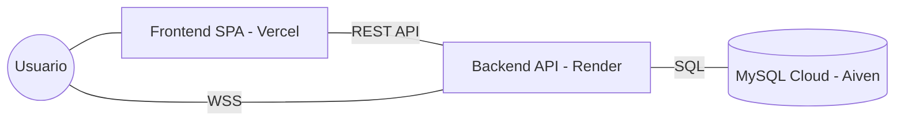

# 🔐 Passly - Sistema de Control de Accesos Inteligente
## v3.0.0 Cloud Edition ☁️

[](https://github.com/islanys31/Passly)
[](https://passly3106.vercel.app)
[](https://nodejs.org)
[](https://helmetjs.github.io/)

**Passly** es una plataforma de gestión de identidades y control de accesos de nivel empresarial, diseñada para modernizar la seguridad en unidades residenciales y complejos corporativos. Mediante una arquitectura distribuida en la nube, Passly ofrece una solución **Zero-Trust** con autenticación biométrica simulada, códigos QR dinámicos y monitoreo en tiempo real.

---

### 🚀 Acceso Rápido
| Servicio | URL |
|----------|-----|
| 🖥️ **Frontend (Vercel)** | [https://passly3106.vercel.app](https://passly3106.vercel.app) |
| ⚙️ **API Backend (Render)** | [https://passly-69ah.onrender.com](https://passly-69ah.onrender.com) |
| 📘 **Swagger Docs** | [https://passly-69ah.onrender.com/api-docs](https://passly-69ah.onrender.com/api-docs) |

> [!TIP]
> **Modo Demo (Magic Login)**: Accede instantáneamente como administrador usando [esta URL de acceso rápido](https://passly-69ah.onrender.com/api/magic/login?role=1). No requiere contraseña.

---

## 🔥 Funcionalidades Core

### 🛡️ Seguridad Avanzada (Hardening v3.0)
- **MFA (2FA)**: Autenticación de dos factores vía TOTP (Google Authenticator).
- **Hardening**: Protección con Helmet.js, Rate Limiting (mitigación de fuerza bruta) y Sanitización XSS.
- **Auditoría**: Logs inmutables de cada acción administrativa con registro de IP.
- **Zero-SMTP**: El sistema no bloquea el flujo si el servidor de correo falla, permitiendo auto-activaciones.

### 🔑 Ecosistema QR
- **QR Identidad**: Llave permanente para residentes vinculada a su ficha maestra.
- **QR Invitado**: Invitaciones temporales firmadas con JWT (auto-expirables).
- **Scanner Web**: Terminal de validación de alta velocidad compatible con cualquier cámara.

### 📊 Analítica y Tiempo Real
- **WebSockets**: Dashboard que se actualiza en vivo sin recargar la página mediante Socket.IO.
- **Advanced Charts**: Visualización de picos de tráfico, censos de usuarios y tendencias semanales.
- **Exportación**: Reportes profesionales en PDF (con branding) y CSV (para Excel).

---

## 🏗️ Arquitectura en la Nube



---

## 📁 Documentación del Proyecto

| Documento | Descripción |
|-----------|-------------|
| [📄 Requisitos](file:///c:/Users/Personal/Passly-1/docs/01_REQUISITOS_Y_PROPUESTA.md) | Definición funcional y propuesta técnica |
| [📊 Diagramas](file:///c:/Users/Personal/Passly-1/docs/02_DIAGRAMAS_SISTEMA.md) | Casos de uso, clases, secuencia y arquitectura |
| [🗄️ Base de Datos](file:///c:/Users/Personal/Passly-1/docs/03_BASE_DE_DATOS.md) | Modelo E-R, normalización 3FN y diccionario |
| [📔 Manuales](file:///c:/Users/Personal/Passly-1/docs/04_MANUALES.md) | Manual de Instalación, Técnico y de Usuario |
| [🧪 Pruebas](file:///c:/Users/Personal/Passly-1/docs/05_PRUEBAS_Y_DISEÑO.md) | Reporte de QA, Seguridad (Hardening) y Estrés |
| [🎓 Guía de Exposición](file:///c:/Users/Personal/Passly-1/docs/00_GUIA_EXPOSICION.md) | Guión para presentaciones en vivo y demos |
| [📑 Ficha Técnica (ES)](file:///c:/Users/Personal/Passly-1/docs/FACT_SHEET_ES.md) | Resumen ejecutivo en español |
| [📑 Fact Sheet (EN)](file:///c:/Users/Personal/Passly-1/docs/FACT_SHEET_EN.md) | Executive summary in English |

---

## 🛠️ Stack Tecnológico

| Capa | Tecnologías |
|------|-------------|
| **Frontend** | Vanilla JavaScript (SPA), CSS3 Moderno, Chart.js, Socket.IO Client |
| **Backend** | Node.js, Express, JWT, Bcrypt, Helmet.js, Nodemailer |
| **Base de Datos** | MySQL 8.0 Cloud (Aiven) |
| **Infraestructura** | Docker, Render, Vercel, GitHub Actions |

---

## 🚀 Inicio Rápido (Local)

```bash
# 1. Clonar e Instalar
git clone https://github.com/islanys31/Passly-1.git
cd Passly-1/backend && npm install

# 2. Base de Datos
mysql -u root -p < ../database/passly.sql

# 3. Iniciar
npm run dev
```

---

## 🆘 Soporte y Desarrollo
- **Mantenimiento**: islanys31
- **Email**: catira3132@mail.com
- **Licencia**: MIT

---

**🔐 Passly v3.0.0** — *Because security should be smart, fast, and beautiful.*
