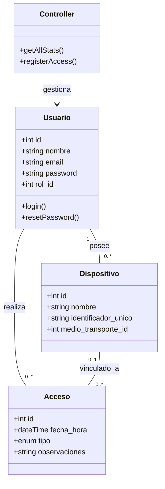
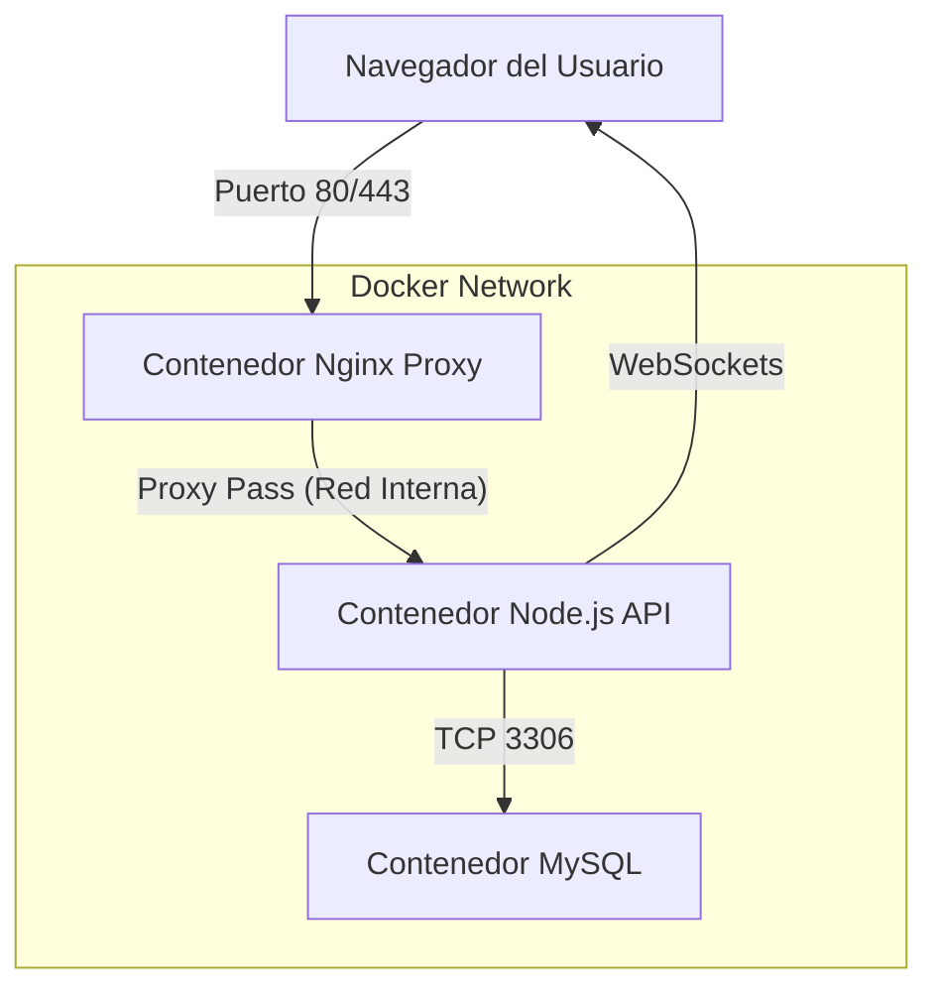

# 📊 DIAGRAMAS TÉCNICOS DEL SISTEMA - PASSLY

## 1. DIAGRAMA DE CASOS DE USO
Representa las interacciones de los actores con el sistema.

```mermaid
useCaseDiagram
    actor "Administrador" as Admin
    actor "Usuario/Empleado" as User
    actor "Seguridad" as Guard

    package "Sistema Passly" {
        usecase "Gestionar Usuarios/Roles" as UC1
        usecase "Registrar Dispositivo" as UC2
        usecase "Registrar Acceso" as UC3
        usecase "Ver Dashboard/Estadísticas" as UC4
        usecase "Recuperar Contraseña" as UC5
    }

    Admin --> UC1
    Admin --> UC2
    Admin --> UC4
    User --> UC5
    Guard --> UC3
    Guard --> UC4
```

---

## 2. DIAGRAMA DE CLASES (MODELO MVC)
Estructura lógica del backend y sus relaciones.



---

## 3. DIAGRAMA DE DESPLIEGUE (DOCKER)
Arquitectura física y red.



---

## 4. DIAGRAMA DE ACTIVIDADES (REGISTRO DE ACCESO)
Flujo lógico del proceso principal.

```mermaid
activityDiagram
    start
    :Seguridad selecciona Usuario;
    :Selecciona Dispositivo (o Peatonal);
    if (Datos completos?) then (si)
        :API valida Token;
        :Registra en BD;
        :Emite evento Socket.io;
        :Dashboard se actualiza;
        stop
    else (no)
        :Muestra error de validación;
        stop
    endif
```
