# 📊 DIAGRAMAS TÉCNICOS DEL SISTEMA - PASSLY

## 1. DIAGRAMA DE CASOS DE USO
Representa las interacciones de los actores con el sistema.

```mermaid
useCaseDiagram
    actor "Administrador" as Admin
    actor "Usuario/Empleado" as User
    actor "Seguridad" as Guard

    package "Sistema Passly" {
        usecase "Gestionar Usuarios/Roles" as UC1
        usecase "Registrar Dispositivo" as UC2
        usecase "Registrar Acceso" as UC3
        usecase "Ver Dashboard/Estadísticas" as UC4
        usecase "Recuperar Contraseña" as UC5
        usecase "Generar QR Personal" as UC6
        usecase "Crear Invitación QR" as UC7
        usecase "Escanear QR" as UC8
        usecase "Exportar Reportes" as UC9
        usecase "Subir Foto de Perfil" as UC10
    }

    Admin --> UC1
    Admin --> UC2
    Admin --> UC4
    Admin --> UC7
    Admin --> UC8
    Admin --> UC9
    User --> UC5
    User --> UC6
    User --> UC10
    Guard --> UC3
    Guard --> UC4
    Guard --> UC8
```

---

## 2. DIAGRAMA DE CLASES (MODELO MVC)
Estructura lógica del backend y sus relaciones.


---

## 3. DIAGRAMA DE DESPLIEGUE (DOCKER)
Arquitectura física y red.


---

## 4. DIAGRAMA DE ACTIVIDADES (REGISTRO DE ACCESO)
Flujo lógico del proceso principal.

```mermaid
flowchart TD
    A[Inicio] --> B{Método de Acceso}
    B -->|Manual| C[Seleccionar Usuario]
    B -->|QR Personal| D[Escanear QR con Cámara]
    B -->|QR Invitado| E[Escanear QR Temporal]
    
    C --> F[Seleccionar Dispositivo / Peatonal]
    F --> G[Seleccionar Tipo: Entrada/Salida]
    G --> H{Datos Completos?}
    H -->|Sí| I[API Valida Token JWT]
    H -->|No| J[Mostrar Error de Validación]
    J --> C
    
    D --> K[Backend Parsea JSON QR]
    K --> L{Usuario Activo?}
    L -->|Sí| I
    L -->|No| M[Error: Usuario Inactivo]
    
    E --> N[Backend Verifica JWT del QR]
    N --> O{Token Válido y No Expirado?}
    O -->|Sí| I
    O -->|No| P[Error: QR Inválido o Expirado]
    
    I --> Q[Registrar en BD]
    Q --> R[Emitir Evento Socket.IO]
    R --> S[Dashboard se Actualiza en Tiempo Real]
    S --> T[Fin]
```



---

## 5. DIAGRAMA DE ACTIVIDADES (RECUPERACIÓN DE CONTRASEÑA)
Flujo del proceso de recuperación.


